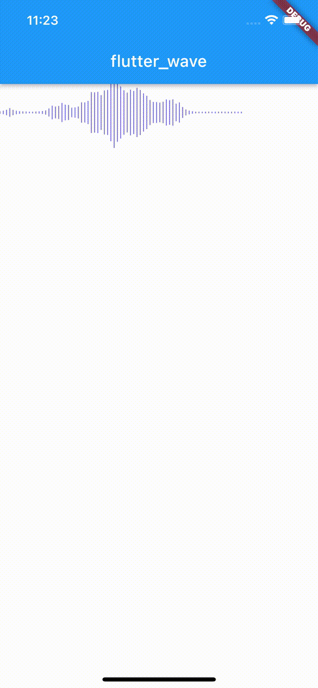

flutter_wave

## Features

一个仿微信音频波浪线动画



## Getting started

wh_flutter_wave: ^0.0.4

## Usage


```dart
class MyWidget extends StatefulWidget {
  const MyWidget({super.key});

  @override
  State<MyWidget> createState() => _MyWidgetState();
}

class _MyWidgetState extends State<MyWidget> {
  double vol = 0;

  @override
  void initState() {
    super.initState();
    var ticker = Ticker((elapsed) {
      setState(() {
        vol = Random().nextDouble() * 10;
      });
    });
    ticker.start();
  }

  @override
  Widget build(BuildContext context) {
    return FlutterWave(
      volume: vol,
    );
  }
}
```

## Additional information


